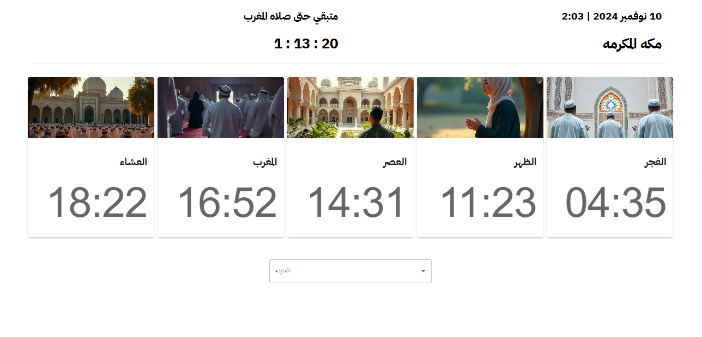

# prayers-timings-react-hooks-tarmez

This is a prayers-timings-App built with ReactJs [hooks] and material ui. it helps you to select your country from select input then you can see time of every pray "muslim pray five times per-day"(العشاء-5,المغرب-4,العصر-3,الظهر-2,الفجر-1) 
the app has a timer that count down till the next prayer "it calculate the difference between the (now time) and the (time of the next pray) using "moment "A JavaScript date library"" and then print on screen the difference between two times and start count down till the next pray and so on ...".it show the date and all info in arabic.

in this project i tried to use new feature like [moment "A JavaScript date library", axios ,material ui]


## Table of contents

- [Overview](#overview)
- [Features](#Features)
- [Components](#Components)
     - [App](#App)
     - [MainContent](#MainContent)
     - [prayer](#prayer)
- [Installation](#Installation)
- [Usage](#Usage)
- [Links](#Links)
- [Screenshot](#Screenshot)
- [What I learned](#what-i-learned)
- [Continued development](#continued-development)
- [Author](#author)
- [Acknowledgments](#Acknowledgments)


## overview
This is a prayers-timings-App built with ReactJs [hooks]. it helps you to select your country from select input then you can see time of every pray "muslim pray five times per-day"(العشاء-5,المغرب-4,العصر-3,الظهر-2,الفجر-1) 
the app has a timer that count down till the next prayer "it calculate the difference between the (now time) and the (time of the next pray) using "moment "A JavaScript date library"" .and then print on screen the difference between two times and start count down till the next pray and so on ...".it show the date and all info in arabic.

in this project i tried to use new feature like [moment "A JavaScript date library", axios ,material ui]


## Features
- simple prayers-timings-App that show us on screen the five prayers . and it has a timer that count down till the next prayer. it show the date and all info in arabic.

## Components

### App

The main component that has a MainContent component that holds the whole logic, and prayer that has info about every pray.

### MainContent

the component that holds the whole logic.

### prayer

the component that show on screen five cards . one for every pray

## Installation
To get started with this project, follow these steps:

you can clone the project or download it as Zip file.
1. Clone the repository:
   ```bash
   git clone https://github.com/olahasan/prayers-timings-react-hooks-tarmez

2. Navigate to the project directory:
   cd <project-directory>

3. Install the required dependencies:
   npm install   


## Usage
To run the application, use the following command:

npm start


## Links

If you want to open the link in a new tab, you can:

- Press **Ctrl** (or **Cmd** on Mac) while clicking the link.
- Right-click the link and select **Open link in new tab**.

Otherwise, all links will open in the same tab.


- Solution URL: [here](https://github.com/olahasan/prayers-timings-react-hooks-tarmez)

- Live Site URL: [here](https://prayers-timings-react-hooks-tarmez.netlify.app/) 

 ## Screenshot
 



## what-i-learned
Through this project:
1. I learned in this simple project how to create react app and treat with function component,
2. how to deal with **Hooks**
3. how to deal with **moment "A JavaScript date library"**
6. how to deal with **material ui**
7. how to deploy it on netlify

## Continued Development
In the future, I plan to:
- learn reactJs Hooks.
- learn redux toolkit with reactJs Hooks.

### Author

GitHub - @olahasan

### Acknowledgments

I would like to thank the **[tarmeez-أكاديمية ترميز](https://www.youtube.com/@tarmeez)** for providing this challenge and to the community for their support.

